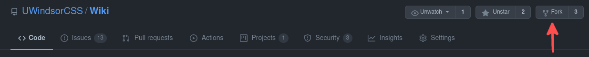
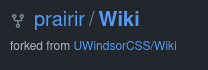
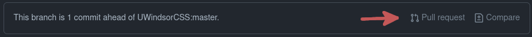
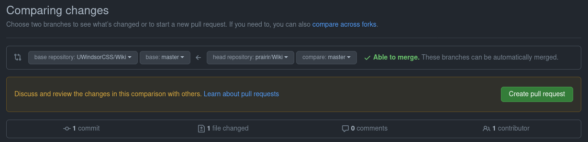
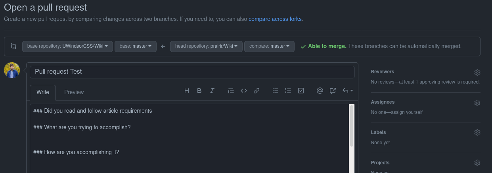
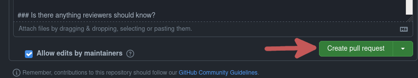
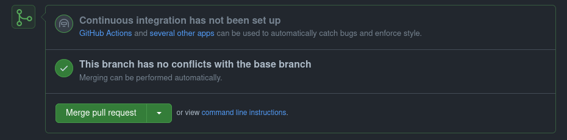

import TOCInline from '@theme/TOCInline';

<div className="inline-toc">
    <h2>Table of Contents</h2>
    <TOCInline toc={toc} />
</div>

## Description

This guide talks is about how to contribute to this wiki

There are 2 main ways to contribute
* Article content, this is writing articles and text content
* Technical work, this is using ReactJS and Docusaurus to edit how the wiki works and acts

## Disclaimer

These instructions are just the simplest way to do these things

If you know what you're and you are sure then you don't need to follow this.

## Requirements

* A github account
* git
* Latest Node.js release
* Latest yarn package manager release
* A text editor

## Forking

Forking is a standard process of making your own copy of a git branch

1. To fork the wiki click [here](https://github.com/UWindsorCSS/Wiki) 
2. click the top right button that says `Fork` <br/> 

3. once you have forked the repository you should see `<Your Github username>/Wiki` on the top left side <br/>


## Cloning

Cloning is the process of making a local copy to your machine of the copy that you made

to clone, launch a console and run
```console
git clone https://github.com/<Your Github username>/Wiki.git
```

If you have it successful then you should have a directory called `Wiki`

Now you are free to make your changes

## Pull Request

Once you you have made your changes you need to make a Pull Request

A Pull Request is a request to make changes on the 'master' or 'main' branch

It is sometimes called a PR or an MR

Now lets jump into changes. You have your fork at `https://github.com/<Your Github username\>/Wiki`

To make a pull request on the source repository, click on the button `Pull Request` on the banner<br/>


Once that is clicked, you will get a page looking similar to 
this<br/>


This page is just to show the changes you've made 

Once you are happy with the changes, click the big green `Create pull request` button

After you clicked the first big green button you will be be brought to a page where you actually create the pull request<br/>


This page is where you put in the title, what you changed, why you changed it, and any other details you thought to include.

Once you are happy with the Pull Request, click the second green button that says `Create pull request`<br/>


Once you finished and clicked the button, you have successfully created a Pull Request on the Wiki. Now just wait for it to be reviewed.

## Reviews

When someone reviews your code they can either have 1/3 options
1. Comment, this is commenting on some changes that you have done
2. Approve, this is approving your changes
3. Request changes, this is requesting changes to your pull request

After the code has been approved, You will see a big green button at the bottom that says `Merge`<br/>



If git can't merge because some issues, it will be red and say `Merge Conflict` or something similar.

Once it has been approved, a maintainer will merge your code into the branch

